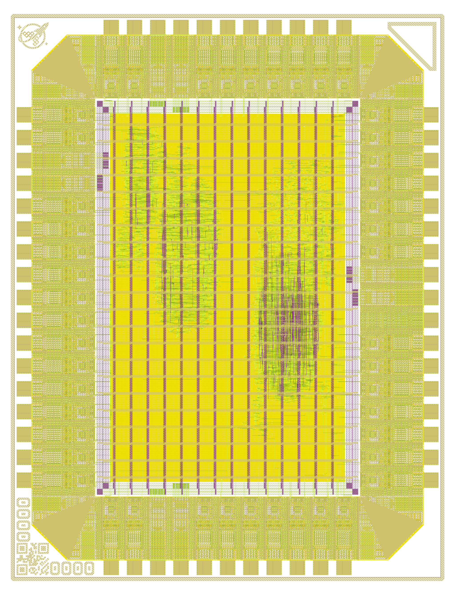

# Expresso ASIC 

Open source Ethernet focused ASIC featuring a 
100Mbps capable cut-through, unmanaged, Ethernet switch. 
This chip is designed for the second run of [wafer.space](https://wafer.space/), 
targetting the Global Foundaries 180 nm process (`gf180mcu`), using the [open source `gf180mcuD` PDK](https://gf180mcu-pdk.readthedocs.io/en/latest/). 

 

Features: 
- Ethernet switch:
  - 4x Full duplex Ethernet ports, 100BASE-TX (classic RJ42 cat-3 connection) 
  - Unmanaged switch 
  - Cut-though forwarding
- Heat death of the Universe counter:
  - Broadcasts an Ethernet Frame over the local network ever 1s
  - 100Mbps Ethernet compatible, 100BASE-TX
  - Our solar system will have been engulfed by the sun before it overflows 

## Coffee-shop family 

This full chip ties together in a single package multiple projects that are all part of larger family of open-source Ethernet connected IP: 
- [`coffeepot` first generation switch.](https://github.com/Essenceia/ethernet_switch_asic) - included 
- [`teapot` Ethernet wrapper for building network connected accelerators.](https://github.com/Essenceia/Teapot)
- [`coldbrew` Ethernet connected beacon for broadcasting an ethernet frame with an uptime count until the heat death of the universe.](https://github.com/Essenceia/Until_Heat_Death_Do_Us_Part) - included

This IP has been re-addapted to make the best use of a full chip tapeout, checkout the `ws_run2` branch or the submodules to see the version of the IP being used.  

## Pinouts 

Since the LAN8720A PHY chip directly supports IO volatages between +1.62V and +3.6V, in order to be easily compatible, our ASIC targets an 
operating volate of 3.3V, which would result in an IO operating also at 3v3. 

The RMII PHY0-3 interfaces are connected to the switch (`coffeepot`), while PHY4 is connected to the beacon (`coldbrew`). 
Both IP share the same power domains, `clk` and `rst_n` signals. 

By default all input pins are pulled down, so in cases where the board doesn't feature a PHY chip connected to a ASIC RMII PHY interface
no additional changes are needed. All output pins are also pull down. 

 

### External PHY chip 

The pin mapping on this `0p5x0p5` slot was specifically designed for unbostructed routing on the pcb between this ASIC and the LAN8720A chip. 

 

(P.S: Although it might sound at first like narrow targetting of a single part this mapping would also be compatible with the parts like the `KSZ8081RNA/RND`.)

## Credits

Thanks to the [Wafer.Space](https://wafer.space/) project, its contributors, and all the community working on open source silicon tools for making this possible.

## License 

This hardware is distributed under the **strongly** reciprocal CERN Open Hardware Licence Version 2 unless
otherwise specified.
